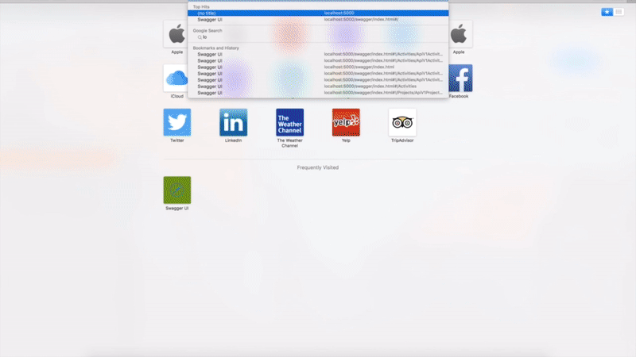

# Welcome to TimeTracking (Web API)

This cool API is going to be used for tracking your time.

For now, I just created some end points for starting, pausing and adjusting time for one project, however, it should be easily add more features soon.

# Stack and concepts used

+ Clean architecture (Mix of onion architecture);
+ CQRS
+ Event Sourcing
+ DDD
+ .NET Core 1.1
+ XUnit
+ EF Core
+ Docker
+ Migrations
+ Postgres

# Requirements

+ Microsoft .NET Core - Version: 1.1.0
+ Docker - Version: 1.13.0

# How to run?

1. `git clone git@github.com:mayconbeserra/timetracking.git`
2. `cd timetracking`
3. `dotnet restore`
4. `docker run --name postgres-timetracking -p 5432:5432 -e POSTGRES_PASSWORD=sql -e POSTGRES_DB=timertracking -d postgres:latest`
5. `dotnet run -p Visma.TimeTracking.MigrationsEventSourcing`
6. `dotnet run -p Visma.TimeTracking.MigrationsProjection`
7. (Mac or Linux) `export DB_CONNECTION_STRING="Host=localhost;Port=5432;Database=timertracking;UserID=postgres;Password=sql;Pooling=true;"`
7. (Windows) `set DB_CONNECTION_STRING="Host=localhost;Port=5432;Database=timertracking;UserID=postgres;Password=sql;Pooling=true;"`
8. `dotnet run -p Visma.TimeTracking.API`

# How to know the routes available?

+ Please, after exec the API, you can access `http://localhost:5000/swagger/index.html`

# Demo

